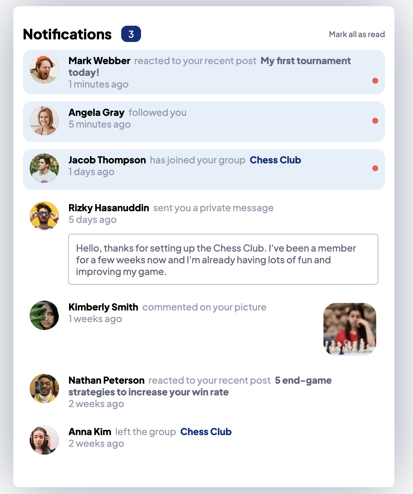

# Frontend Mentor - Notifications page solution

This is a solution to the [Notifications page challenge on Frontend Mentor](https://www.frontendmentor.io/challenges/notifications-page-DqK5QAmKbC). Frontend Mentor challenges help you improve your coding skills by building realistic projects.

## Table of contents

- [Overview](#overview)
  - [The challenge](#the-challenge)
  - [Screenshot](#screenshot)
  - [Links](#links)
- [My process](#my-process)
  - [Built with](#built-with)
  - [What I learned](#what-i-learned)
- [Author](#author)

## Overview

### The challenge

Users should be able to:

- Distinguish between "unread" and "read" notifications
- Select "Mark all as read" to toggle the visual state of the unread notifications and set the number of unread messages to zero
- View the optimal layout for the interface depending on their device's screen size
- See hover and focus states for all interactive elements on the page

### Screenshot



### Links

- [Solution](https://github.com/kalexei/notifications-page)
- [Live Site](https://kalexei-notificationspage.netlify.app/)

## My process

### Built with

- [React](https://reactjs.org/) - JS library
- [Vite](https://vitejs.dev/) - Dev Environment
- CSS custom properties (variables)
- Flexbox
- Mobile-first workflow
- [Google Fonts](https://fonts.google.com/)

### What I learned

When I first saw this challenge I thought it would be nice to try and solve it using my favourite JS library - React, rather than basic HTML, and instead of hard-coding all the elements, create a Notification component and make it reusable. The problem I first ran into is that, every notification looks different based on what type it is, some of them are what I called "reaction" notifications, some are "join-group" or "leave-group" and so on, so I had to make some different layouts for every type and I chose to make one big ternary operator, which is not the only and probably not the most viable solution. I could've used a switch statement instead, or even better, make a separate component for every type of notification and display those when needed. However, given this is a simple, barely interactive page, I didn't bother optimising and the most important thing is that I learnt something along the way.

Since I decided to use React, I wanted to be able to add any notifications without having to hard-code them into the layout, so I broke the notifications down into what they consist of and made an array, here it is with one of them:

```js
const notifications = [
  {
    user: "Mark Webber",
    avatarUrl: "/images/avatar-mark-webber.webp",
    type: "react",
    content: "My first tournament today!",
    read: false,
    time: 60,
  }
];
```

So every notification has a name of the user who initiated it, their avatar (AKA profile picture), the type of the notification ("react", "join/leave-group", "follow", "message" or "comment"), the content inside, which depends on the type, for example if it's a "react", it is the post which the person reacted to, or if it is a "comment", the content is the picture of the post they commented under, all according to the challenge. The notification also has the time, in seconds, for which it has existed, and read/unread status. The reason I used a number of seconds for the time, is because I wanted to be able to sort the order of the notifications based on how recent they are, and then to display the time properly, I created a convertTime function, which could be improved but I didn't want to spend too much time (ironically) on it:

```js
function getConvertedTime() {
  let newTime = time;
  let measurement = "seconds";

  if (newTime % 60 === 0) {
    newTime /= 60;
    measurement = "minutes";
  }

  if (newTime % 60 === 0) {
    newTime /= 60;
    measurement = "hours";
  }

  if (newTime % 24 === 0) {
    newTime /= 24;
    measurement = "days";
  }

  if (newTime % 7 === 0) {
    newTime /= 7;
    measurement = "weeks";
  }

  return `${newTime} ${measurement}`;
}
```

Basically, the function checks if the variable "time" is divisible by 60, and if so divides it by that, chainging the measurement variable to minutes, then does the same and changes it to "hours" and so on. The maximum measurement in the case of this challenge I needed was "weeks" so I stopped there. The problem with this is that the measurement is always plural, I could've checked if the final number is 1 or more and adjusted that accordingly.

In terms of CSS, the first thing I did and always prefer to do is to do a so-called "reset" as well as set the widths and heights of all the top-level elements to the max:

```css
/* index.css */
*,
*::before,
*::after {
  margin: 0;
  padding: 0;
  box-sizing: border-box;
  font-family: "Plus Jakarta Sans", sans-serif;
  font-weight: 500;
}

:root {
  width: 100vw;
  height: 100vh;

  --color-red: hsl(1, 90%, 64%);
  --color-blue: hsl(219, 85%, 26%);
  --color-white: hsl(0, 0%, 100%);
  --color-vlgb: hsl(210, 60%, 98%);
  --color-lgb1: hsl(211, 68%, 94%);
  --color-lgb2: hsl(205, 33%, 90%);
  --color-gblue: hsl(219, 14%, 63%);
  --color-dgblue: hsl(219, 12%, 42%);
  --color-vdblue: hsl(224, 21%, 14%);
}

#root {
  width: 100%;
  height: 100%;
}

/* App.css */
.App {
  width: 100%;
  height: 100%;
}
```

As you can also see, I used the CSS variables to store all the colors I was given, so I don't have to look up the value every single time I want to use a certain color.

For the Notification component I created a separate CSS file, and for every different type of notification, I had to write a lot of different styles, for basically the same elements, and I had t create a lot of class names, again, not the most optimal thing in the world, but I recognise it and in future if I'm making something I wouldn't repeat the same mistake.

## Author

- Github - [kalexei](https://github.com/kalexei)
- Frontend Mentor - [@AlekseiK412](https://www.frontendmentor.io/profile/AlekseiK412)
- Twitter - [@\_kalexei\_](https://www.twitter.com/_kalexei_)
